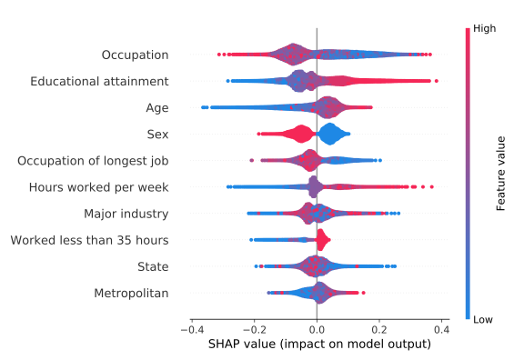

# Capstone project 1 "What affects our salary. Analysis and predictions based on the 2007 CPS" repository.

The repository contains all the scripts notebooks and submission files for the project : "What affects our salary. Analysis and predictions based on the 2007 CPS"

The 2007 United States Department of Commerce Current Population Survey (CPS) consists of approximately 200,000 individual records obtained from 60,000 households, from which approximately 100,000 belongs to working adults. In the project an in depth analysis was performed to determine key features which affect our salary. A classier was designed to identify low income individuals. The feature importance provide an insight to the traits that make the most impact on a person salary and compliment the statistical analysis.

 
###### Tree SHAP analysis ([https://arxiv.org/abs/1802.03888](https://arxiv.org/abs/1802.03888)) produces the ten most important model features

The repository contains the flowing files and directories:
1. '/Data' - A folder containing all of the datasets used in the project + a code manual
2. '/best_estimators' - A folder containing pickled files of the trained best estimators + dictionaries 
with the best meta parameters for each one.
3. '/figures' - Figures used in the final report
4. 'Milestone Report.ipynb' - A notebook containing the data cleaning and statistical inference steps
5. 'Evaluating_classifiers.ipynb' - A notebook with an example code which shows how different classifiers are evaluated. 
and meta-parameters grid search. The final evaluations was performed on a computer grid using a python scrips
6. 'EST_*.py' - Different example scripts which were run on a computer cluster to grid search for the best meta parameters.
7. 'SHAP.ipynb' - A notebook for generating feature importance using SHAP
8. 'PredictSex.ipynb' - A notebook with the result of adjusting the classifier to predict sex
9. 'ScalerAndOneHotEncoder.py' - A custom transformer which OneHot encode categorical features while scaling the numerical ones. for easier use in pipelines
10. 'dataset_manipulation_functions.py' - File containing utility functions to load filter and manipulate the dataset
